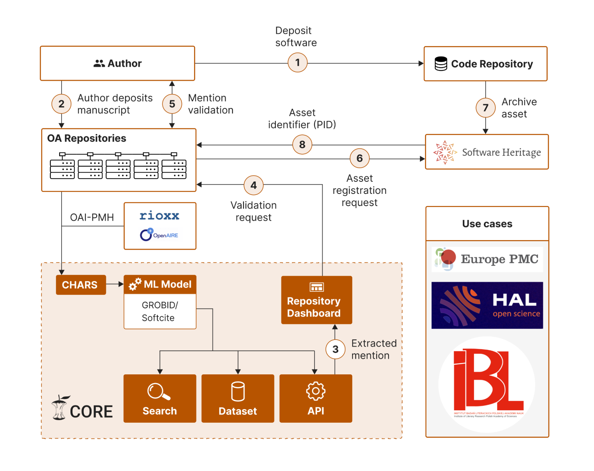

# Introduction

## Making Software FAIR: A machine-assisted workflow for research software

**SoFAIR implementation will establish research software citations & mentions as first-class bibliographic records.** This will enable correct attribution, which is key for researchers, and provide a new way research software is identified, validated, registered and archived for the long term. 

The SoFAIR workflow (Figure 1) shows how stakeholders, tools and infrastructures work together. An author deposits a piece of research software in a code repository [1]. The author then deposits a manuscript that contains either explicit or implicit mentions of that software [2]. The research paper is then harvested from the repository by CORE and software mentions extracted from the full text research paper using extended state-of-the-art ML tools (GROBID / Softcite (Lopez, et al., 2021)) [3]. Via the CORE Repository Dashboard, a request to validate the extracted mentions is made available to the repository [4] and, with the authorisation of the repository manager, routed to the author (e.g. by means of an email notification) who validates this request [5]. Once validated, the repository issues an asset registration request to Software Heritage [6] who permanently archive the new software asset [7] and issue a permanent identifier for the new asset and send this back to the repository [8].

*Figure 1: The SoFAIR workflow*

Following this, repositories will be able to expose information linking software assets with research outputs that mention them within their OAI-PMH feed to aggregators and do so in an interoperable fashion.  The efficacy of the solution will be validated within two disciplinary use cases: 1) a life sciences use case conducted in cooperation with Europe PMC and a 2) digital humanities use case conducted in cooperation with DARIAH. An additional multidisciplinary use case will be conducted in cooperation with the HAL repository.

## The audience and actors 

This documentation is intended for developers implementing the SoFAIR workflow. 

The actors that are part of the workflow scenario are:

1. The author / research team
2. The Open Access repositories curators / archivists / moderators 
3. The annotators (when annotation isn’t automatic)