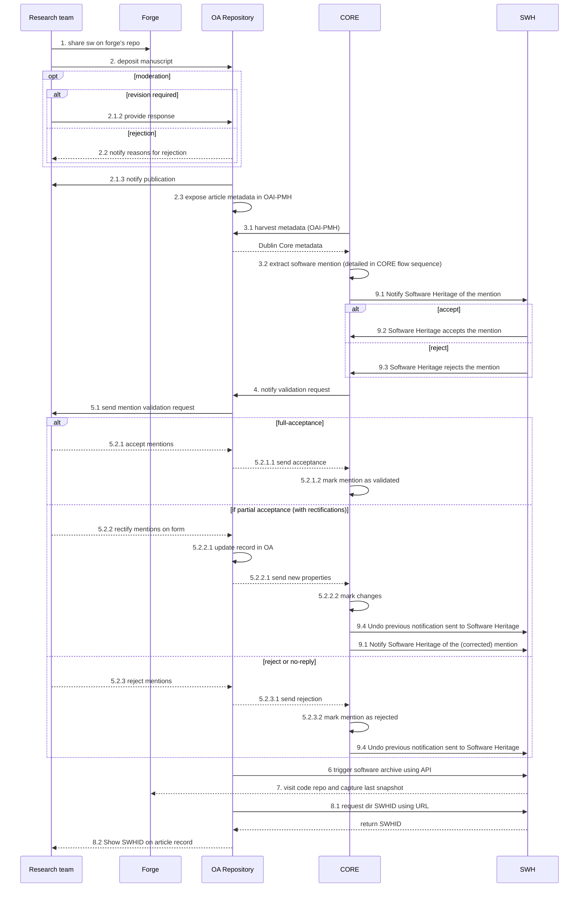
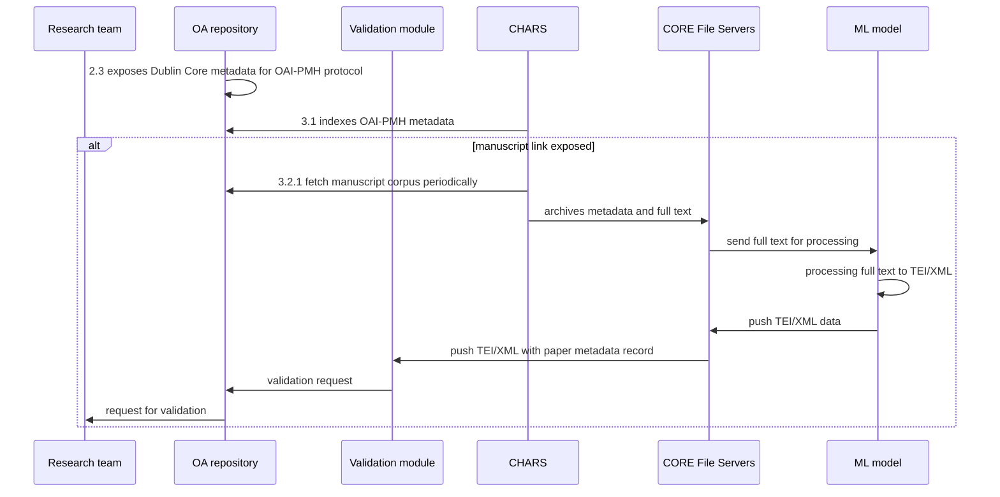

# Workflow

This documentation will assist service providers, mainly OA repositories, to
provide a new service to authors that want to seamlessly connect their articles
with an archived instance of their software source code.

## The use cases

UC1: A researcher references software in their article and would like to have
tools to easily link and archive their software output on the metadata record

UC2: An OA repository manager wants to provide a software reference service to
their users with the assistance of CORE’s harvest

These use cases are aligned with the Open Science vision to create
interoperability in the scholarly ecosystem and provide tools and
infrastructure for reproducible research.

## The sequence diagrams

### The full workflow sequence diagram

The sequence diagram below is the nominal scenario of the full workflow.

A research team develops software in a software forge (e.g. GitHub, GitLab,
etc.) using a dedicated code repository. This software is related to the
article written by the research team.

The research team, represented by the corresponding author or the deposit
contributor, deposits the manuscript and its associated metadata into one or
more Open Access (OA) repositories, possibly triggering a moderation process to
ensure uniqueness and cohesion.

If successful, OA repository metadata is later indexed by CORE, using OAI-PMH
protocol.

The metadata and manuscript is processed by the CORE system, including the
CHARS component, the CORE File System servers and the ML model component which
returns a TEI/XML file with mentions.

CORE will push the TEI/XML and full text to the validation module. The
validation module sends validation request to OA repository which in turn will
notify the corresponding author, representing the research team.

The corresponding author will have the possibility to validate the request.

If validated, the OA repository will proceed in the archival of the software
through Software Heritage and will expose the appropriate SWHID.

### The CORE components sequence diagram

**Pre-conditions:** repository manager accepts notifications about mentions.
The acceptance is possible using the CORE repository dashboard.

The sequence diagram below is specific to the different components necessary in
the CORE service backend.

