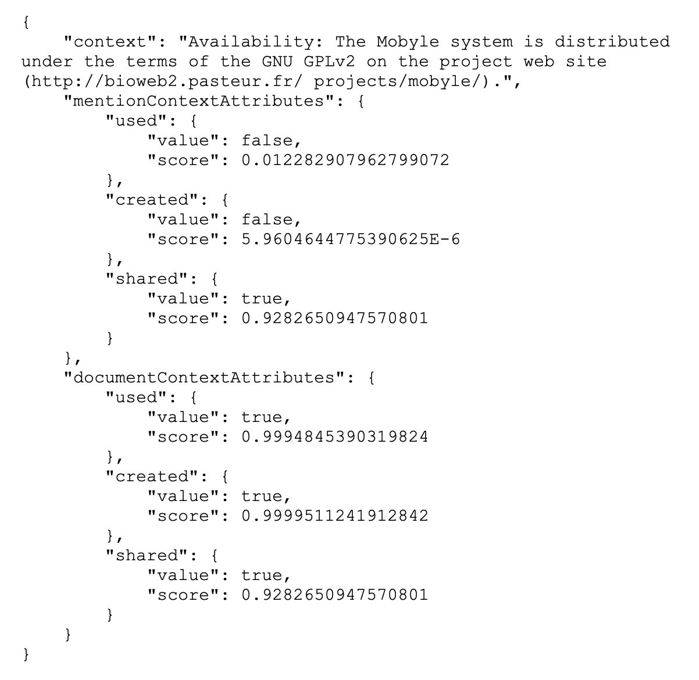

# Step 3: Extracted mention

## Context: CORE ingestion and indexing pipeline

The CORE harvesting process can be described as a pipeline where each task
performs a certain action and where the output of each task feeds into the next
task. The input to this pipeline is a set of data providers and the final
output is a system populated with records of research papers available from
them. The main types of key tasks currently performed as part of CORE’s
harvesting system are described in the action section.

**The trigger:** CORE indexes a metadata record containing a software asset
mention repository.

**End result**: reference of software asset to validate with Author.

## Action

### 3.1 Harvest metadata

#### 3.1.1 Metadata download

The Dublin Core metadata exposed by a data provider via OAI-PMH are downloaded
and stored in the file system (typically as an XML). The downloading process is
sequential, i.e. a repository provides typically between 100–1,000 metadata
records per request and a resumption token. This token is then used to provide
the next batch. As a result, full harvesting can take a significant amount of
time (hours-days) for large data providers. Therefore, this process has been
implemented to provide resilience to a range of communication failures.

#### 3.1.2 Metadata extraction

Metadata extraction parses, cleans, and harmonises the downloaded metadata and
stores them into the CORE internal data structure (database). The harmonisation
and cleaning process addresses the fact that different data
providers/repository platforms describe the same information in different ways
(syntactic heterogeneity) as well as having different interpretations for the
same information (semantic heterogeneity).

#### 3.1.3 Full text download

Using links extracted from the metadata CORE attempts to download and store
publication manuscripts.

#### 3.1.4 Conversion from text to semi-structured format

Plain text from the downloaded manuscripts is extracted and processed to create
a semi-structured representation. This process includes a range of information
extraction tasks, such as references extraction. In this step we perform a
Grobid+Softcite extraction (described more in detail in 3.2) and we store the
results.

#### 3.1.5 Enrichment

The enrichment task works by increasing both metadata and full text harvested
from the data providers with additional data from multiple sources. Some of the
enrichments are performed directly by specific tasks in the pipeline such as
language detection and document type detection. The remaining enrichments that
involve external datasets are performed externally and independently to the
CHARS pipeline and ingested into the dataset as described in the Enrichments
section. In this step, we read the Grobid+Softcite file extracted and run
disambiguation and resolution (described more in detail in 3.2).

#### 3.1.6 Indexing

The final step in the harvesting pipeline is indexing the harvested data. The
resulting index powers CORE’s services, including search, API and FastSync.

### 3.2 Extract software mentions (T6.2)

The following steps will be integrated as part of the overall CORE ingestion
and extraction pipeline:

#### 3.2.1 Manuscript parsed by SoftCite / Grobid

Where a full text manuscript has been discovered and downloaded during the
CHARS process (section 3.1.3 above), the parsing of the manuscript using
SoftCite will be integrated as a part of the Information enrichment process
(3.1.4). This will identify software mentions and the links to the appropriate
software repository contained within the fulltext manuscript.

The JSON metadata output from the Softcite module for each paper (See Figure 1
below) is then combined with the OAI-PMH metadata from the paper itself to then
be marked for validation by the author.

*Figure 1: Sample JSON output from Softcite*

This information is collated on a per-repository basis and will be sent to the
author, via the repository for validation as described in Step 4 below.

#### 3.2.2 Disambiguation of existing software asset

Given the name of software and its basic information described as metadata (e.g
CodeMeta), determine the correct code repository including its base URL. For
example, in the manuscript, the name of software `<Octopus>` was mentioned and
extracted. We know it was created by the authors. There are 20 repositories in
Github with the same name. Determine which repository was meant and retrieve
its base URL.

#### Disambiguation of software usage

Softcite already attempts to disambiguate between several types of software
usage. Every mentioned software in a document is automatically enriched with
usage, creation and sharing information based on the different software mention
contexts in the document. In the JSON results, mentioned software are
characterised with the following attributes:

* Used: the mentioned software is used by the research work disclosed in the
  document.
* Created: the mentioned software is a creation of the research work disclosed
  in the document or the object of a contribution of the research work.
* Shared: software is claimed to be shared publicly via a sharing statement
  (note: this does not necessarily mean that the software is Open Source.)

#### Disambiguation of software correct url

Disambiguation can relate to different possibilities, such as:

- incomplete metadata exposed by the OA
- accuracy of the extracted mentions
- primary research software introduced.

Even if a mention of the primary software is found, it is important to note
that Software is a complex artefact and the development of this artefact may
have occurred under different urls with the common practice of using forks. For
this reason the validation of the mention and url by the author is necessary in
step 4.
