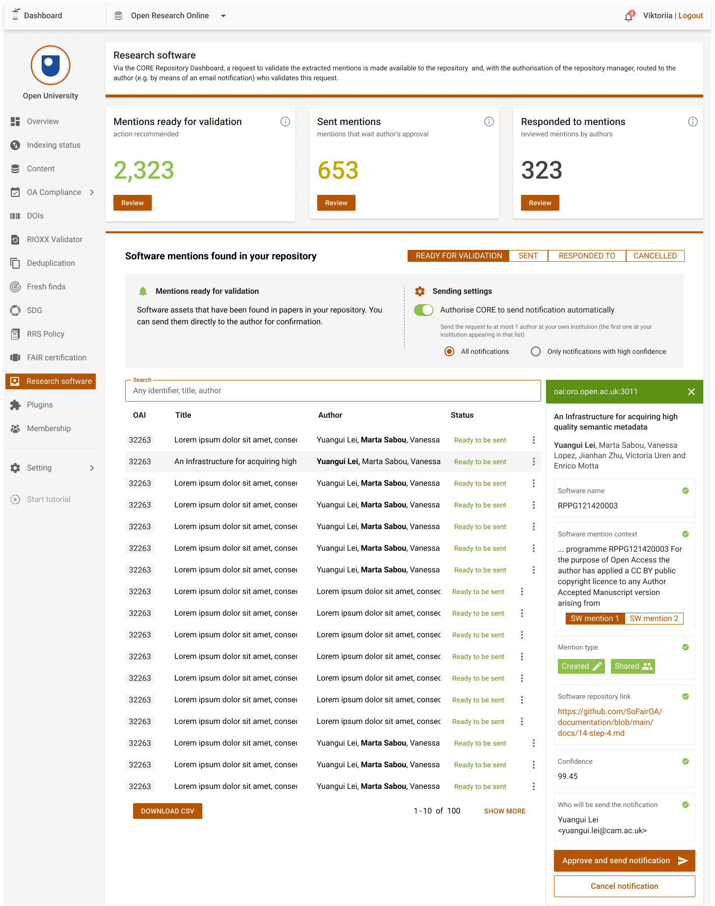

# Step 4: Notify validation request

## Context

**Pre-conditions:** repository manager accepts notifications about mentions, using the CORE repository dashboard.

**The trigger:**  A mention was identified with or without an url to a code repository.
With this trigger the validation process will begin to get the author’s approval.
The approval is about the connection between the article and identified software mentioned.

**End result:** article id, software url or name sent to OA.

## Action: Integration of notifications with repository platforms (T6.3) 

The notification sent to the repository will contain the following information about a paper that has been analysed as containing software mentions; 

From the paper metadata: 

* `paper_id`
* `paper_title`

From the Softcite metadata: 

* `software_mention_context`
* `software_mention_attributes`
* `software_repository_link`

## CORE Dashboard - new notifications tab / module (T6.1)

For the management of notifications, CORE will develop a new module for its existing repository dashboard. The repository manager will need to enable notifications and provide the endpoint URL to which notifications should  be sent. 

OA MUST have credentials to connect to the dashboard and enable notifications.

*Figure 1:  CORE Dashboard module*
