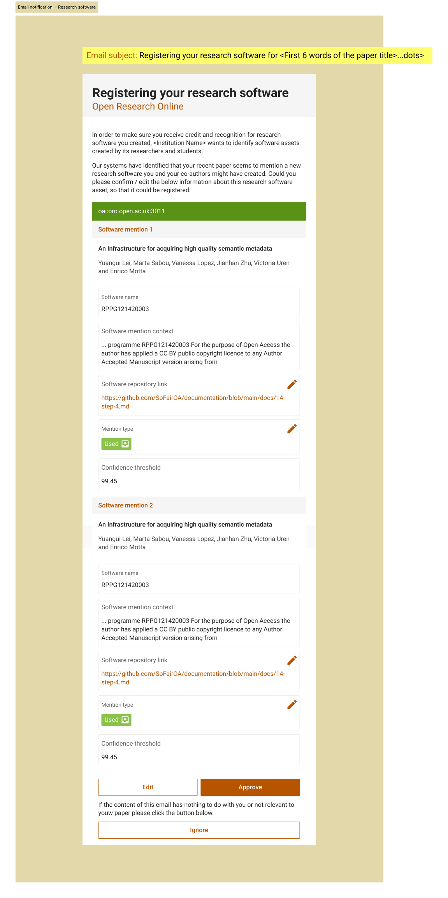
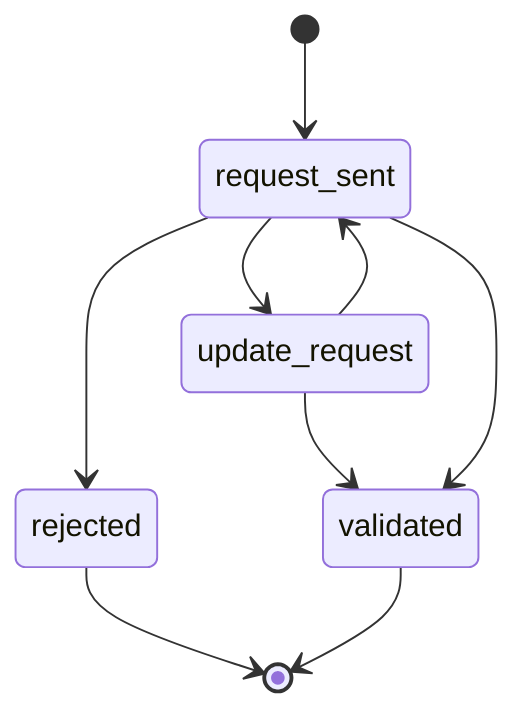
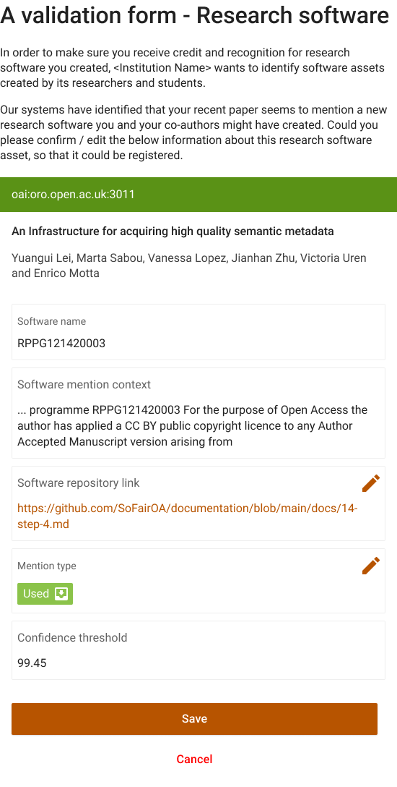

# Step 5 Validation of software mentions

## Context

Once enabled in the CORE Dashboard, the notifications will be sent to the repository endpoint via the COAR-Notify protocol. When a notification is received by the repository, the repository will forward the information to the named author for validation. This will take place via email, however contact with authors will be managed by the repository. 

**The trigger:** 

## Action

### 5.1 OA send mention validation request

The OA repository sends an email notification to the author using the `<author_email>` in the OA database with the elements from step 4, following one of the email request templates in [templates](https://github.com/SoFairOA/documentation/tree/main/docs/templates).

The OA repository needs to provide an endpoint (or a default email address if the process is manual) to allow the Validation Application to prepare an email to forward to the authors. 
The endpoint parameters and protocol will differ depending on the repository software implementation but it its minimal defition should work like the following example:

```

POST https://repository/email-resolver-endpoint
{"identifier": "https://research-organisation.org/repository/record/201203/421/"}

Response:
200 OK
{"identifier":"https://research-organisation.org/repository/record/201203/421/",
"authorEmails":["author1@research-organisation.org", ...]}

404 Not found - Option 1: supply default email
{"defaultEmail": ""author1@research-organisation.org"}

404 Not found - Option 2: no action
{}

```

The validation application will create the email similar to the following example:




### 5.2 Management of author responses

There can be a number of distinct responses from the author at this stage; 

* 5.2.1 Validation details are fully correct, all fields are correctly populated, the link to the software repository is valid. (user clicks approve) 🟢
* 5.2.2 Validation details are only partially correct, fields are not correctly populated or the link to the software repository is not valid. (User clicks edit) 🟡
    * When partially correct, the author insert correct elements in the specific fields on a dedicated form proposed by the OA repository. 
* 5.2.3 Validation details are not correct, the software mention has been mis-identified or mis-extracted and cannot be validated. (User clicks reject) 🔴
    * An important case to keep track of in a list at OA and in CORE so that the author isn’t asked again for the same software name
    * The risk of having only two options is to have the authors swamped with validation requested without the possibility to reject



To avoid overloading authors with requests which may lead to them being ignored, only one validation request should be attempted per manuscript. 

The validation request will only take place once a new software asset has been identified. This stage is however dependent on the successful implementation of the disambiguation of software assets in 3.2.2.

If the user needs to edit the mention before validating, it will be presented with a form as follow:




Once validated, the asset registration process begins.
 

